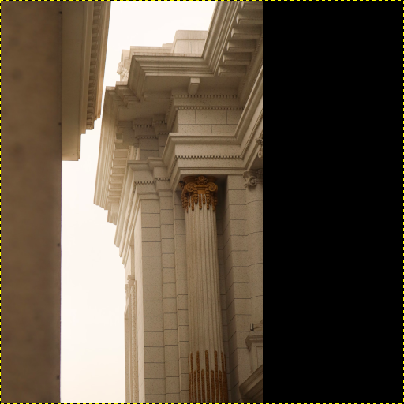
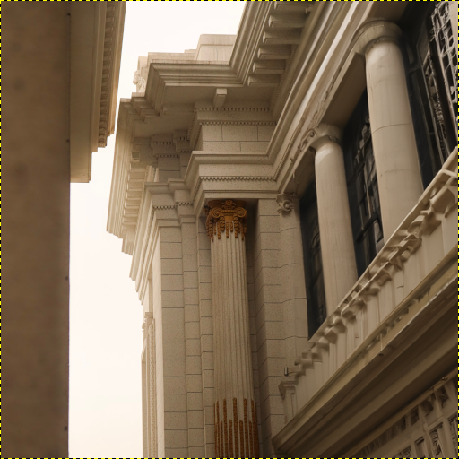

# GIMP Plugin DALL·E

## Introduction

This is a plugin for the GNU Image Manipulation Program, [GIMP](https://www.gimp.org/), making it possible to use [OpenAI](https://openai.com/)'s API [endpoint for image editing](https://platform.openai.com/docs/api-reference/images/create-edit). 

## Usage

You provide an image in one layer. A region of the layer needs to be fully transparent. Then you execute the plugin and the image gets send to OpenAI's API. The API creates content for the masked pixels and the result is fed back to GIMP as a second layer.

<table>
  <thead>
    <tr>
      <th>Layer 1: Input Image with fully transparent region</th>
      <th>Layer 2: Generated output</th>
    </tr>
  </thead>
  <tbody>
    <tr>
      <td></td>
      <td></td>
    </tr>
  </tbody>
</table>

### Attribution
This is the [source image](https://unsplash.com/photos/WGhdiuvN4lE) by [Nhan Hoang](https://unsplash.com/@httnhan) for the example above.

## Installation
* Either take one of the folders found in GIMP: `"Edit" > "Preferences"` then `"Folders" > "Plug-Ins"` or add a folder there
* Copy the folder `gimp-plugin-dall-e` of this repository to that folder
* Make sure `gimp-plugin-dall-e/gimp-plugin-dall-e.py` is executable
* Restart GIMP

## Trying It Out
* Open `./data/sample.xcf` of this project with GIMP
* Click `"Filters" > "Dall-E"`
* Enter your OpenAI API key
* Enter a prompt
* Click generate (note that the plugin uses a paid endpoint, so you will be charged by OpenAI for usage)

## Limitations
* Currently the plugin only works with a resolution of `512 px * 512 px`.
* The plugin only works if you provide a source image in layer 1 with a fully transparent region. This region will be filled with generated content.
* It takes some seconds for OpenAI to generate the output, so GIMP might assume the plugin crashed, just click "wait".

## Related
* https://github.com/danielgatis/rembg
* https://github.com/blueturtleai/gimp-stable-diffusion
    * Video about the above: https://www.youtube.com/watch?v=-2lCYCNQPRI
* https://github.com/manu12121999/RemoveBG-GIMP